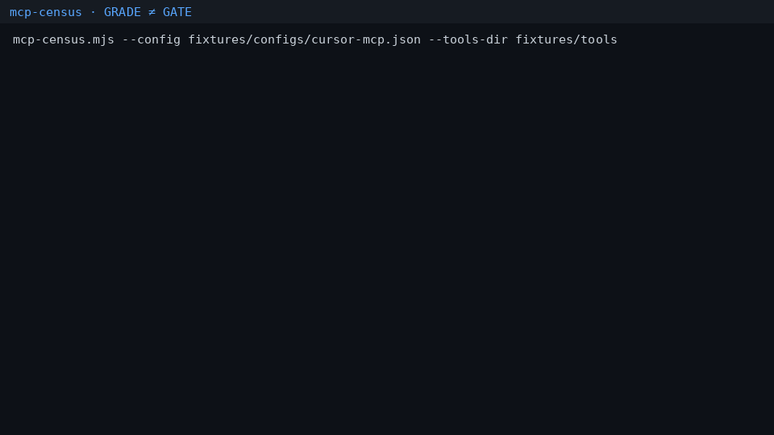

# mcp-census

> **GRADE ≠ GATE** — Inventory your local MCP fleet. A high grade is not a runtime gate.

`mcp-census` is a free CLI that practitioners can run in minutes:

1. **Discover** MCP servers from Cursor / Claude Desktop / Continue / `mcp.json`
2. **Fingerprint** tool definitions (SHA-256 via `@sentinelreign/guard-core`)
3. **Grade** each server’s `tools/list` with the published mcpgrade rubric
4. **Report gate gaps** when you have visibility but no runtime enforcement

No cloud account. No remote exploits. Defensive inventory only.

| Demo (thesis teaser) | Production gate |
| --- | --- |
| [mcp-grade-neq-gate](https://github.com/cyb3rvolt3x-A4lixhaS3ntin3l/mcp-grade-neq-gate) | [sentinelagent-guard](https://github.com/cyb3rvolt3x-A4lixhaS3ntin3l/sentinelagent-guard) |


## Demo



## Install (minutes)

```bash
git clone https://github.com/cyb3rvolt3x-A4lixhaS3ntin3l/mcp-census.git
cd mcp-census
npm install
npm link   # optional: puts mcp-census on PATH
```

Requirements: Node.js 20+.

## Quick start

```bash
# Scan well-known client config paths on this machine
mcp-census

# Or point at a config + offline tool fixtures (CI / demo)
mcp-census \
  --config fixtures/configs/cursor-mcp.json \
  --tools-dir fixtures/tools

# JSON for pipelines
mcp-census --config fixtures/configs/cursor-mcp.json --tools-dir fixtures/tools --json
```

### Demo output (fixture)

```
mcp-census — MCP fleet inventory
thesis : GRADE ≠ GATE

source : fixtures/configs/cursor-mcp.json (cursor)
  server : notes    transport=stdio
  server : weather  transport=stdio

grades
  notes                    A+ (100)  decision=allow  tools=2
  weather                  C (60)    decision=block  tools=1
    - L1.TOOL_POISONING [critical] ...

gate gap
  You have inventory visibility (or none) without a runtime gate.
  - [critical] NO_RUNTIME_GATE: No runtime gate detected...
```

Exit code `2` when a critical gate gap is present (CI-friendly).

## How grading works

Grades come from [`@sentinelreign/guard-core`](https://www.npmjs.com/package/@sentinelreign/guard-core) — the same deterministic engine behind SentinelAgent Guard (mcpgrade rubric). Census does **not** enforce policy at runtime; it tells you when you are flying inventory-only.

## CLI

| Flag | Meaning |
| --- | --- |
| `--config <path>` | Client config to parse (repeatable). Also auto-scans well-known paths. |
| `--tools-dir <dir>` | Offline `<serverName>.json` tool lists for grading without spawning servers |
| `--json` | Machine-readable report |
| `--baseline <path>` | Declare a baseline file (affects gate-gap section) |
| `--write-baseline <path>` | Freeze hashes for the first graded server (helper) |

### Live `tools/list` (roadmap note)

v0 grades from `--tools-dir` fixtures or inventory-only discovery. A follow-up will add opt-in local stdio handshake (`tools/list`) for servers you explicitly allow — still no remote exploit path.

## Tests

```bash
npm test
npm run demo
```

## Layout

```
bin/mcp-census.mjs
src/           discover, grade, census, report
fixtures/      sample configs + tool lists
test/          node:test
```

## Security & ethics

- Local configs and fixtures only unless you pass paths.
- Does not include malware, exploit PoCs, or attack runbooks.
- Authorized defensive use: inventory *your* agent stack.

## License

Apache-2.0

## Related

- [mcp-grade-neq-gate](https://github.com/cyb3rvolt3x-A4lixhaS3ntin3l/mcp-grade-neq-gate) — GRADE ≠ GATE demo
- [sentinelagent-guard](https://github.com/cyb3rvolt3x-A4lixhaS3ntin3l/sentinelagent-guard) — production runtime gate
- [gungnir](https://github.com/cyb3rvolt3x-A4lixhaS3ntin3l/gungnir) / [gungnir-lab](https://github.com/cyb3rvolt3x-A4lixhaS3ntin3l/gungnir-lab)
